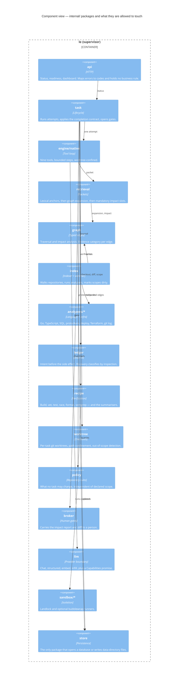

# C4 level 3: components

Inside the supervisor. Every box is a package under `internal/`.

## The rules this diagram encodes

**Everything persistent goes through `store`.** §2.3 requires it and a custom
`go/analysis` analyzer (`tools/analyzers/storescope`) enforces it: `sql.Open` and
file writes outside `internal/store` and `internal/artifacts` fail the build.
Four packages are exempt and each entry in the list must say why — the identity
pin, operator configuration, git checkouts, and memory notes are repository or
config files rather than workspace state.

**`api` holds no business rule.** A rule that only holds over HTTP does not hold
when the worker does the same thing. The handler maps domain errors to status
codes and nothing else.

**Edges point consumer → consumed, everywhere.** Impact analysis is a *reverse*
traversal, so an `implements` edge pointing interface → type would report zero
implementations when a method is added to an interface — exactly the question
the edge exists to answer. A cross-analyzer test holds Go and TypeScript to the
same invariant.

**The engine cannot reach outside its worktree.** Path confinement lives in
`internal/worktree`, not in the engine, because the paths come from the model
and confinement that lives next to the caller is confinement the caller can
forget.

## Reading order for a newcomer

1. `internal/store` — everything else is scoped by it.
2. `internal/ledger` — intent-first journalling, and what recovery does with it.
3. `internal/graph` — the direction invariant, and why evidence categories exist.
4. `internal/task` — the completion contract, which is where acceptance is decided.
