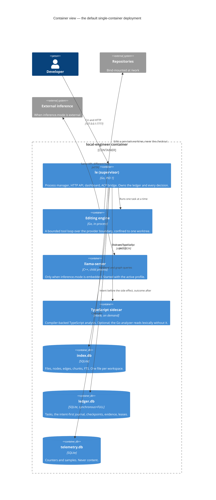

# C4 level 2: containers

What runs, and where the data lives.

## Why one container (DR-1)

The conventional layout is one process per container so the orchestrator can see
each. Here the supervisor **already is** a process manager with a ledger, so
putting the children under it keeps one lifecycle and one health endpoint. The
trade-off is stated rather than hidden: several processes under one PID 1 reduce
orchestrator visibility.

`deploy/docker-compose.split.yml` is the conventional layout for anyone who
wants it, and it is exercised in CI against a stub inference service — not
merely parsed — because the claim it makes is that pointing the supervisor at an
external inference container is a configuration change only.

## Why three databases, not one

§5.2: a large index rebuild must never block the ledger, and the ledger must be
backed up independently at high frequency. They also have different durability
needs — `synchronous=FULL` for the ledger, `NORMAL` for the other two — and one
file cannot have two settings.

## Where the boundaries actually are

The worktree is the one that matters. The engine never edits the developer's
checkout: it works in a per-task worktree, and an accepted change is applied
through a gate. A crash therefore cannot leave the developer's files half-edited,
which is what makes the recovery procedure worth having.

Next: [component view](c4-component.md).
