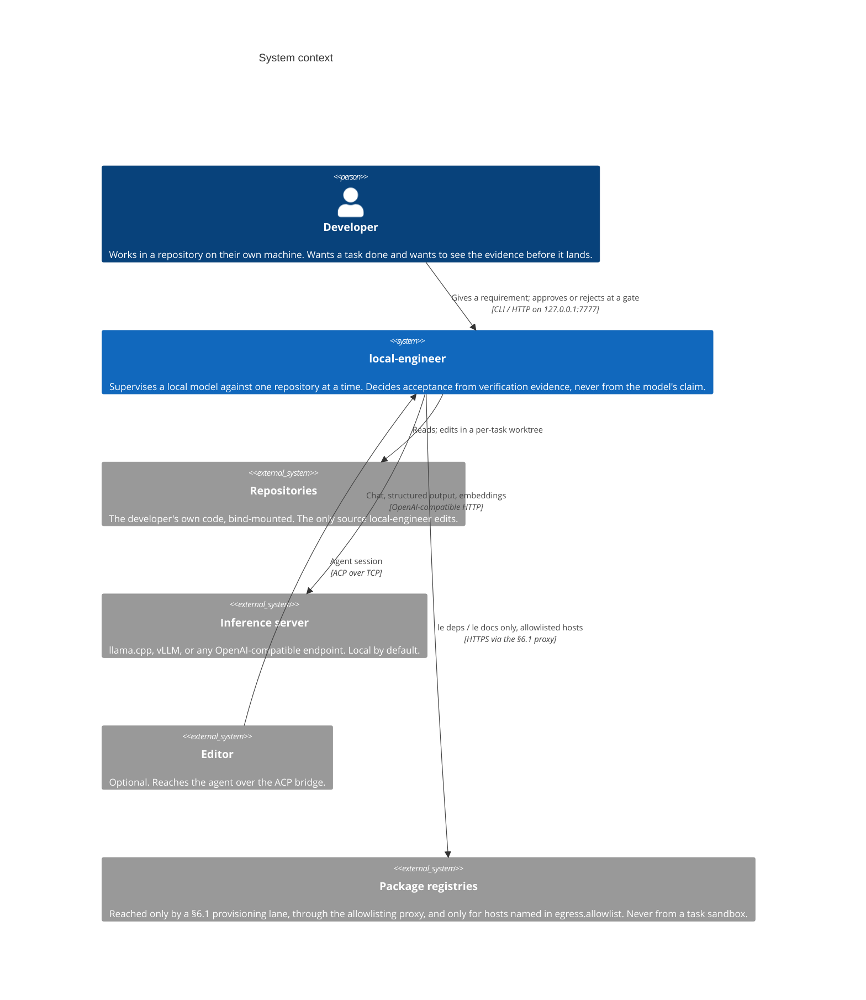

# C4 level 1: system context

Who uses local-engineer, and what it talks to.

## What this level is for

Two boundaries are the point of the picture, and both are constraints rather
than connections:

**The developer is in the loop by design.** The arrow from the developer is not
"starts a job" — it is "approves or rejects at a gate". §3.3 puts an impact
report and a diff in front of a person before a change is applied. A system that
applied its own changes would need a different context diagram and a different
trust argument.

**Nothing reaches the network from a task.** The registry arrow comes from a
§6.1 provisioning lane — `le deps` or `le docs`, run by an operator between
tasks — not from a sandbox running one. Verification runs with `GOPROXY=off`,
and a task's Landlock ruleset never includes the proxy port. Drawing one arrow
for "the internet" would hide the only part of this worth knowing: which side
of the boundary the arrow starts on.

## What is deliberately absent

There is **no telemetry endpoint, no license server, and no account**. Telemetry
is a local SQLite file (§5.2). The system runs with `--network none` plus an
in-container inference route, and the tutorial says so.

Next: [container view](c4-container.md).
